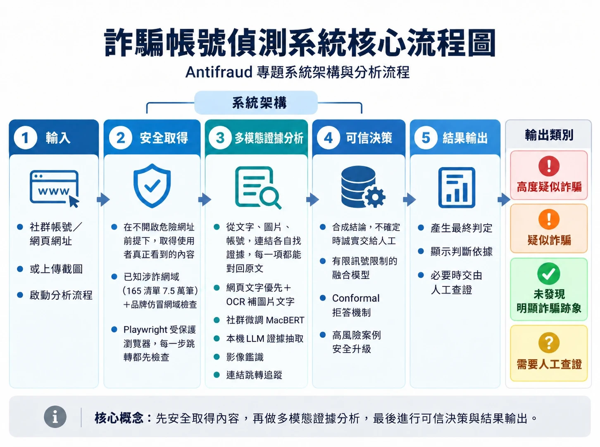

# 詐騙帳號偵測系統－整合影像鑑識與 LLM 技術

輸入**社群帳號／網頁網址**，或上傳**截圖**，系統會實際開啟頁面與連結，結合文字模型、本機 LLM 與影像鑑識，給出四種結論之一，並附上判斷依據：

**高度疑似詐騙**｜**疑似詐騙**｜**未發現明顯詐騙跡象**｜**需要人工查證**



## 系統架構：三層

| 層 | 做什麼 | 主要技術 |
|---|---|---|
| **① 安全取得** | 在不開啟危險網址的前提下，取得使用者真正看到的內容 | 已知涉詐網域（165 清單 7.5 萬筆）＋品牌仿冒網域檢查；Playwright 受保護瀏覽器，每一步跳轉都先檢查 |
| **② 多模態證據分析** | 從文字、圖片、帳號、連結各自找證據，每一項都能對回原文 | 網頁文字優先＋OCR 補圖片內文字；社群微調 MacBERT；帳號特徵；本機 LLM 證據抽取；影像鑑識；連結跳轉追蹤 |
| **③ 可信決策** | 合成結論，不確定時誠實交給人工 | 有符號限制的融合模型 → Conformal 拒答 → 硬證據安全升級 |

## 設計原則

- **網域檢查只負責已知風險**：偵測「已知涉詐網域（165）＋品牌仿冒網域」，命中就不開啟網頁。它不能涵蓋所有新出現的詐騙網站；沒命中的網域交給內容與連結分析判斷。
- **網頁文字優先，OCR 只補圖片內文字**：先用網頁上的文字（濾掉選單、按鈕）；OCR 只處理圖片裡才有的字，並和網頁文字對齊、去重、校正讀錯的字。網頁內容一直變動、拿不到穩定文字時，才改用整張截圖的 OCR。
- **LLM 負責證據抽取與可解釋性**：Qwen2.5-7B 判斷文字是否在招攬讀者，列出詐騙手法並附逐字引用。消融實驗顯示**它不是準確率的主要來源**（數字見下方實測成效），價值在於讓結論有看得懂、可核對的理由。
- **模型先下基礎結論，硬證據再做安全升級**：融合模型與 conformal 先產生基礎結論；165 命中、仿冒、冒用品牌、已知詐騙圖等硬證據**只會提高風險**。「高度疑似詐騙」只由硬證據產生，模型單獨判斷最高為「疑似詐騙」。
- **分布外偵測只提醒**：文字和訓練資料差太多時，提醒文字分數參考價值較低，不直接改變結論。
- **「需要人工查證」是安全設計**：證據不足或互相矛盾時不硬判，避免冤枉正常帳號、也避免放過詐騙。

<!-- results:start（由 run_experiments.py 自動產生，請勿手動修改） -->
## 實測成效

測試資料：數位發展部「網路詐騙通報查詢網」中主管機關已判定的案例，**198 筆（85 詐騙、113 非詐騙）**，和訓練資料依帳號、聯絡方式、相似文字分組，完全不重疊。以下所有數字都由 `run_experiments.py` 從同一份 [`docs/experiment_results.json`](docs/experiment_results.json) 產生，與 [實驗結果](docs/experiment_results.md) 和網站上的「系統實測成效」一致。

**① 全體分類效能**（每一筆都強制判為詐騙或正常）

| Precision | Recall | F1（95% 信賴區間） | FPR | AUC |
|---:|---:|---:|---:|---:|
| 73.0% | 63.5% | 67.9%（57.1%～77.6%） | 17.7% | 0.86 |

**② 加上「需要人工查證」之後**（和①分母不同，不能直接比較）

| 交給人工的比例 | 已判斷樣本的準確率 | 詐騙覆蓋率 | 正常覆蓋率 |
|---:|---:|---:|---:|
| 38.9% | 90.1% | 94.1% | 93.8% |

**③ 各平台**（全體分類，不拒答）

| 平台 | 詐騙／非詐騙 | F1 | FPR |
|---|---:|---:|---:|
| Threads | 56／52 | 69.4% | 15.4% |
| Facebook | 20／34 | 66.7% | 17.6% |
| 一般網頁 | 9／18 | 63.6% | 33.3% |
| LINE／TikTok／IG／YT | 0／9 | — | 0.0% |

**和原始 MacBERT 比較**（同一份測試集，每一筆都強制判定）：原始模型 `anti_fraud_E3_macbert` 是用詐騙對話訓練的，直接拿來判斷社群貼文幾乎抓不到詐騙；`macbert_social` 是在它的基礎上，用官方判定的社群貼文與 PTT 一般文章再微調（做法見[系統運作說明](docs/system_walkthrough.md#macbert-的三個版本)）；完整系統再加上帳號特徵、LLM、影像鑑識一起融合。

| 模型 | Precision | Recall | F1 | FPR | AUC |
|---|---:|---:|---:|---:|---:|
| 原始 MacBERT（anti_fraud_E3_macbert） | 25.0% | 2.4% | 4.3% | 5.3% | 0.48 |
| 社群微調 MacBERT（macbert_social） | 72.4% | 64.7% | 68.3% | 18.6% | 0.83 |
| 完整系統（macbert_social＋證據融合） | 73.0% | 63.5% | 67.9% | 17.7% | 0.86 |

**LLM 的貢獻**：消融實驗中，加入 LLM 讓 F1 變化 +2.2 個百分點；完整模型關掉 LLM，F1 變化 -2.1 個百分點。LLM 不是準確率的主要來源，定位是證據抽取與可解釋性。

其他：訓練時沒看過的 PTT 看板一般文章，誤判為詐騙的比例 8.6%。官方資料中 LINE、TikTok、IG 的詐騙案例內容多已被移除（只剩預設圖示），無法用於評估。融合模型的權重與門檻見[實驗結果](docs/experiment_results.md#融合模型權重與門檻)，代表性案例見 [demo 案例](docs/demo_cases.md)。
<!-- results:end -->

## 代表性案例

截圖都放在 `data/demo/`，可以直接上傳到網站重跑；詳細的證據與說明見 [demo 案例](docs/demo_cases.md)。

| # | 案例 | 輸入 | 結論 | 展示的重點 |
|---|---|---|---|---|
| 1 | 真詐騙 | `data/demo/case1_invest_group.jpg`（冒用名人頭像：「進群組可加我賴ID」） | 疑似詐騙 | 一句話也能抓出投資詐騙話術 |
| 2 | 正常帳號 | `https://www.threads.com/@dcard.tw` | 未發現明顯詐騙跡象 | 官方帳號的一般貼文不會被誤判 |
| 3 | 新聞討論 | `https://www.ptt.cc/bbs/DigiCurrency/M.1786064365.A.F39.html` | 未發現明顯詐騙跡象 | 「在討論詐騙」不等於「在詐騙」 |
| 4 | 仿冒網域 | `data/demo/case4_fake_myship_chat.jpg`（假 7-11 賣貨便連結） | 高度疑似詐騙 | 模型先判疑似，連結追蹤的硬證據再升級 |
| 5 | 需要人工查證 | `data/demo/case5_line_chat.jpg`（自我介紹前後矛盾的 LINE 聊天） | 需要人工查證 | 證據不足時不硬判 |

更多說明：[系統運作說明](docs/system_walkthrough.md)（輸入一個網址後的每一步、網頁每個區塊的意思）。

---

## 在電腦安裝與執行

以下以 **Windows 10／11 + PowerShell** 為例。macOS／Linux 的差異寫在每一步的備註。

### 需要準備

| 項目 | 說明 |
|---|---|
| Python 3.12 | https://www.python.org/downloads/ （安裝時勾選「Add python.exe to PATH」） |
| Git | https://git-scm.com/downloads |
| 硬碟空間 | 約 6 GB（Python 套件 3 GB、模型 0.4 GB、LLM 4.7 GB） |
| 顯示卡（選用） | NVIDIA 顯示卡可加速；**沒有顯示卡也能執行**，只是比較慢 |
| 網路 | 第一次執行會下載 OCR 模型；分析網址時需要連上該網站 |

### 1. 下載程式

```powershell
git clone https://github.com/Zcc209/scam-detector-llm-forensics.git
cd scam-detector-llm-forensics
```

### 2. 建立虛擬環境並安裝套件

```powershell
py -3.12 -m venv .venv
.\.venv\Scripts\Activate.ps1
python -m pip install --upgrade pip
```

如果出現「因為這個系統上已停用指令碼執行」，先執行 `Set-ExecutionPolicy -Scope CurrentUser RemoteSigned`，再重新啟用虛擬環境。macOS／Linux 改用 `python3.12 -m venv .venv` 與 `source .venv/bin/activate`。

接著安裝 PyTorch，**二選一**：

```powershell
# 有 NVIDIA 顯示卡
python -m pip install torch==2.3.1 torchvision==0.18.1 --index-url https://download.pytorch.org/whl/cu121
# 沒有顯示卡（CPU 版）
python -m pip install torch==2.3.1 torchvision==0.18.1 --index-url https://download.pytorch.org/whl/cpu
```

再安裝其他套件和瀏覽器：

```powershell
python -m pip install -r requirements.txt
python -m playwright install chromium
```

### 3. 放入 MacBERT 模型

模型檔太大（約 380 MB），不放在 GitHub。請從雲端下載 [macbert_social.zip](https://drive.google.com/file/d/1NgAbpjChd6UDuxgK23RqRxmHYsOynJqP/view?usp=drive_link)，解壓縮到專案的 `models/` 資料夾，會得到 `models/macbert_social/`。

解壓縮後的資料夾結構：

```text
scam-detector-llm-forensics/
  models/
    macbert_social/
      config.json
      model.safetensors
      tokenizer.json、tokenizer_config.json、vocab.txt、special_tokens_map.json
    fusion_model_social.json      ← 已在 GitHub 上，不用另外下載
    ood_reference_social.json     ← 已在 GitHub 上
  web_server.py
```

### 4. 安裝本機 LLM（選用，但建議）

1. 到 https://ollama.com/download 下載安裝 Ollama。
2. 下載模型（約 4.7 GB）：

   ```powershell
   ollama pull qwen2.5:7b
   ```

3. Ollama 安裝後會在背景執行（網址 `http://127.0.0.1:11434`）。

**沒有裝 Ollama 也能用**：網頁會顯示「本次沒有取得 LLM 分析」，其他證據照常判斷；融合模型訓練時已模擬過 LLM 缺席的情況。

### 5. 啟動網站

```powershell
python web_server.py
```

用瀏覽器開啟 **http://127.0.0.1:8765**，輸入網址或上傳截圖即可。

- 第一次分析會下載 EasyOCR 的文字辨識模型（約 100 MB），需要多等一兩分鐘。
- 每次分析大約 10 秒～3 分鐘，視網頁與連結數量而定。
- 換連接埠：`python web_server.py --port 8766`。
- 網站只接受本機連線（127.0.0.1／localhost），不適合直接開放到公開網路。

### 6. demo 前的自我檢查

```powershell
python -m unittest discover -s tests
python scenario_check.py
```

`scenario_check.py` 會實際跑 10 個情境：5 個網址（官方帳號、165 涉詐網站、仿冒網址、政府網站、不存在的網域），以及 5 張 `data/demo/` 裡的示範截圖。最後一行應為 `failures: 0`。沒裝 Ollama 時加 `--no-llm`。

---

## 常見問題

| 狀況 | 解法 |
|---|---|
| 啟動時出現「無法啟動：目前使用的 Python…缺少套件」，或每次分析都顯示「分析已停止」 | 網站是用系統的 Python 啟動的，不是專案的虛擬環境。先執行 `.\.venv\Scripts\Activate.ps1`，再執行 `python web_server.py` |
| `MacBERT model missing` | 沒有放模型，或資料夾放錯層。確認 `models/macbert_social/config.json` 存在 |
| 網頁顯示「頁面需要登入才能查看」 | Instagram／Facebook 對未登入的瀏覽有限制。請改用截圖模式上傳 |
| 「本次沒有取得 LLM 分析」 | Ollama 沒有啟動，或沒有執行 `ollama pull qwen2.5:7b` |
| 顯示卡記憶體不足 | EasyOCR 在顯示卡剩餘記憶體少於 1.5 GB 時會自動改用 CPU，不需處理 |
| `playwright` 找不到瀏覽器 | 重新執行 `python -m playwright install chromium` |
| 開啟網址出現 403 | 請用 `http://127.0.0.1:8765` 或 `http://localhost:8765` 開啟，不要用電腦的區域網路 IP |

---

## 命令列用法

```powershell
python run_pipeline.py --url "https://www.instagram.com/帳號/"      # 完整分析網址
python run_pipeline.py --image "C:\path\to\screenshot.png"          # 分析截圖
python run_pipeline.py --url "https://example.com" --domain-only    # 只檢查網域
python run_pipeline.py --url "https://example.com" --explain        # 另外產生熱點圖
```

其他選項：`--no-llm`（不用 LLM）、`--no-follow`（不追蹤連結）、`--output-dir`（指定輸出資料夾）。結果存在 `artifacts/`，包括 `report.json`、截圖與執行紀錄。

## 重新訓練（選用，需要 NVIDIA 顯示卡與 Ollama）

資料集已在 `data/`（官方判定案例、PTT 困難負樣本、圖片雜湊庫、165 清單）。微調以原始版 MacBERT 權重為起點，需放在 `anti_fraud_E3_macbert/`：

```powershell
python build_dataset.py
python score_dataset.py base
python finetune_macbert.py --batch 16 --max-length 256
python score_dataset.py rescore --model-path models/macbert_social
python score_dataset.py llm
python compare_recipes.py      # 選用：同一份測試集上比較新舊資料取樣方式
python run_experiments.py
```

最後一步會從同一次實驗產生所有數字：`docs/experiment_results.json`（唯一的數字來源）、`docs/experiment_results.md`、README 的「實測成效」、`models/fusion_model*.json`（網站上的「系統實測成效」讀這個檔）。`tests/test_results_consistency.py` 會檢查這幾份是否一致，手動改其中一份會讓測試失敗。

## 專案結構

| 路徑 | 內容 |
|---|---|
| `web_server.py`、`ui/` | 網站後端與前端（HTML／CSS／JavaScript） |
| `run_pipeline.py` | 主流程 |
| `domain_check.py`、`web_capture.py` | 網域檢查、網頁擷取 |
| `content_filter.py`、`alignment.py`、`integrated_app.py`、`inference.py` | 文字整理、OCR、MacBERT |
| `account_signals.py`、`llm_evidence.py`、`image_forensics.py`、`link_tracer.py`、`ood.py` | 各項證據 |
| `fusion_model.py`、`conformal.py`、`risk_assessment.py` | 融合、拒答、結論 |
| `attribution.py`、`report_explanation.py` | 熱點圖與報告說明 |
| `collect_*.py`、`build_dataset.py`、`score_dataset.py`、`finetune_macbert.py`、`compare_recipes.py`、`run_experiments.py` | 資料蒐集、訓練與評估 |
| `data/` | 165 清單、資料集、詐騙圖片雜湊庫、示範截圖 |
| `models/` | 融合模型與分布外偵測參考值（MacBERT 權重另外下載） |
| `docs/` | 說明文件、實驗結果、流程圖 |
| `tests/`、`scenario_check.py` | 單元測試與端對端自我檢查 |

## 使用限制

- 結論只針對這次看到的頁面或截圖，不代表已證實帳號身分。
- 評估涵蓋 Threads、Facebook 與一般網頁；LINE、TikTok、IG 的官方詐騙案例幾乎都已移除內容，目前無法評估這些平台。
- 網域檢查只能抓已知涉詐網域與品牌仿冒網域，新出現的詐騙網站要靠內容與連結分析。
- 評估資料是貼文文字與圖片（官方網站遮蔽了原始網址），不含完整的網址擷取流程；規則判定（165、仿冒、連結追蹤）另外運作，不含在上面的數字中。
- 預設使用未登入的瀏覽器，不會繞過平台的登入限制。
- 分析結果僅供參考，不能取代官方查證。遇到可疑情況請撥打 **165 反詐騙諮詢專線**。
