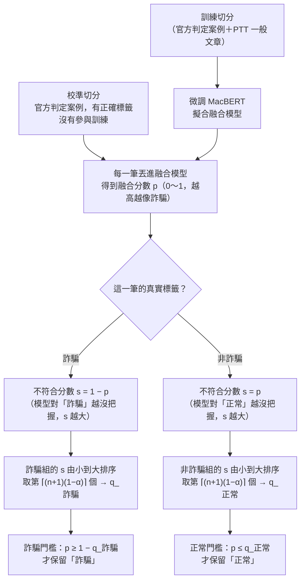
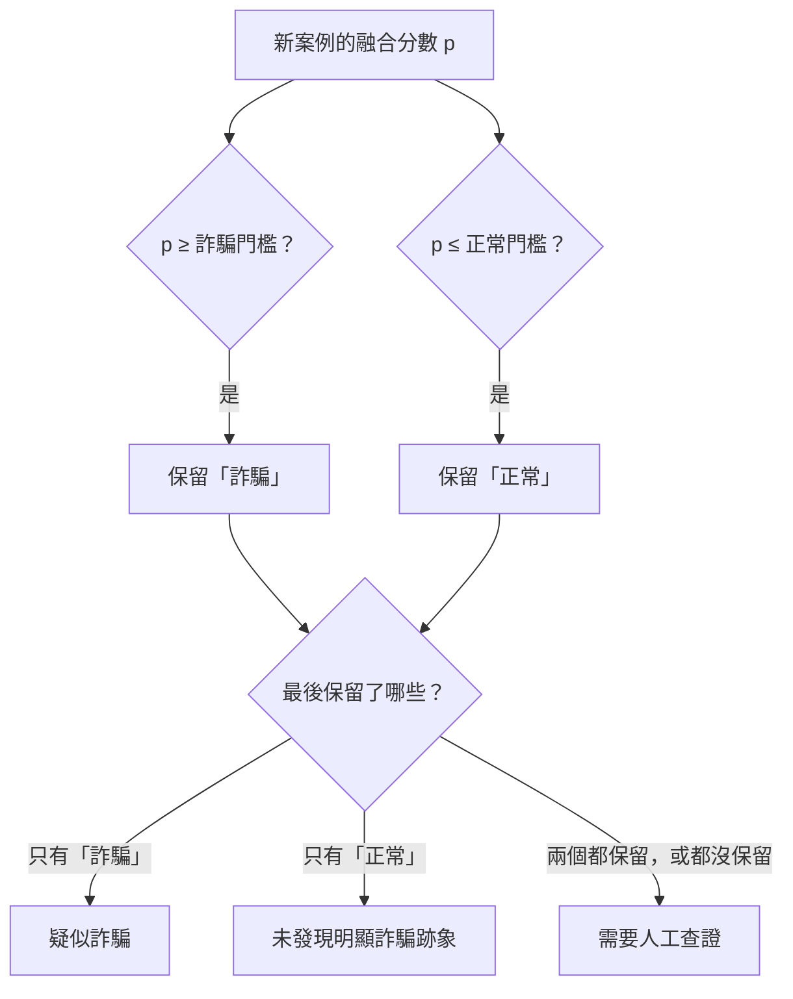
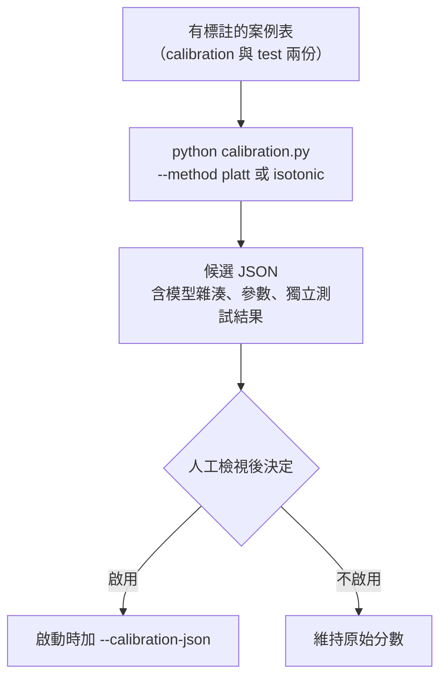
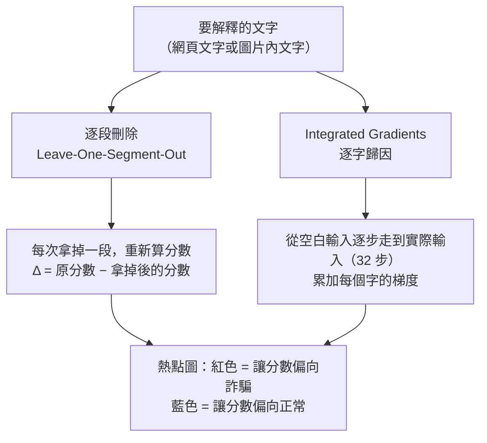

# 拒答門檻、分數校準與熱點圖

這份文件說明三件容易混淆的事：

| 主題 | 回答的問題 | 網站上有沒有在用 | 程式 |
|---|---|---|---|
| **一、Conformal 拒答門檻** | 融合分數多高才敢說「詐騙」、多低才敢說「正常」、什麼時候交給人工？ | **有**，每次分析都用 | `conformal.py`、`run_experiments.py` |
| **二、分數校準（Platt／Isotonic）** | 模型說 80%，實際上真的有 80% 是詐騙嗎？ | 預設**沒有**，是需要明確啟用的選用功能 | `calibration.py` |
| **三、熱點圖** | 是哪些字、哪些段落讓分數變高？ | 勾選「產生熱點圖」才執行 | `attribution.py` |

---

## 一、Conformal 拒答門檻

### 一句話

模型訓練完之後，拿一份**有正確答案、但沒參與訓練**的資料丟進融合模型，看模型對「正確答案」有多沒把握，再用分位數定出兩條門檻。分數落在兩條門檻之間的案例，系統不下結論，交給人工。

### 門檻是怎麼算出來的



逐步說明：

1. **準備校準資料**。資料集依帳號群組切成訓練、校準、測試三份，同一個帳號只會出現在其中一份。門檻只用**校準切分裡的官方判定案例**來算（PTT 一般文章不參與）。
2. **取得融合分數**。把每一筆校準案例丟進已經訓練好的融合模型，得到 p。
3. **算不符合分數**（nonconformity score）。它不是一般說的「誤差」，而是「**模型給正確答案的機率有多低**」：
   - 真實是詐騙的案例：s = 1 − p
   - 真實是非詐騙的案例：s = p
4. **兩類分開取分位數**（這就是 Mondrian／class-conditional 的意思）。α = 0.1 代表每一類最多容許 10% 的真實案例被排除。分位數取的是第 ⌈(n+1)(1−α)⌉ 小的值；多出來的「+1」是小樣本修正，讓保證在樣本不多時仍然成立。
5. **換算成兩條門檻**。
   - q_詐騙 的意思是「90% 的真詐騙，s 都不超過它」，也就是 p ≥ 1 − q_詐騙。
   - q_正常 的意思是「90% 的真正常，p 都不超過它」。

**小例子**（數字是為了說明而編的，不是實際結果）：校準資料裡有 9 筆真詐騙，融合分數是 0.99、0.97、0.95、0.92、0.90、0.85、0.70、0.40、0.06。不符合分數 s = 1 − p 由小到大是 0.01、0.03、0.05、0.08、0.10、0.15、0.30、0.60、0.94。n = 9、α = 0.1，要取第 ⌈10 × 0.9⌉ = 第 9 個，也就是 0.94。所以 q_詐騙 = 0.94，詐騙門檻是 p ≥ 0.06：只要分數不低於 6%，就不能排除它是詐騙。

實際使用的兩條門檻與校準筆數列在[實驗結果的「融合模型權重與門檻」](experiment_results.md#融合模型權重與門檻)，每次重新訓練後自動更新。

### 新案例怎麼用這兩條門檻



因為詐騙門檻通常很低、正常門檻通常很高，所以實際上分成三段：分數很低 → 只剩「正常」；分數很高 → 只剩「詐騙」；中間一大段兩者都保留 → 交給人工。

程式裡還有一條保險規則：如果只剩下一類，但和分數方向相反（例如分數超過 50% 卻只剩「正常」），就改成兩類都保留。這只會讓系統更保守，不會破壞下面的保證。

之後硬證據（165 清單、仿冒網域、冒用品牌、已知詐騙圖）還可能把結論再往上提高，完整順序見[系統運作說明](system_walkthrough.md#四種結論怎麼區分)。

### 這樣做保證了什麼、沒保證什麼

- **保證**：只要新案例和校準資料「性質相近」（統計上叫可交換），真正的詐騙至少有 90% 會保留「詐騙」，真正的正常至少有 90% 會保留「正常」。這個保證不管模型好不好都成立；模型越差，中間交給人工的範圍就越大。
- **不是**「判斷的準確率 90%」。它保證的是「正確答案不會被排除」，不是「每個結論都對」。
- **前提會被打破的情況**：平台不同（校準資料以 Threads、Facebook、一般網頁為主）、時間久了詐騙話術改變、實際上線時詐騙比例遠低於資料集。
- **一個誠實的限制**：校準切分也被用來挑 MacBERT 微調的最佳 epoch（early stopping），所以它不是百分之百「沒被看過」。影響很小（只是在 4 個 epoch 裡挑一個），而且我們另外用完全沒碰過的**測試切分**驗證了覆蓋率，數字在 README「實測成效」的②。

### 你可能會問

| 問題 | 回答 |
|---|---|
| 為什麼不直接設「60% 以上算詐騙」？ | 人訂的門檻沒有依據，也無法回答「錯的機率多高」。Conformal 的門檻從資料算出來，而且附帶覆蓋率保證 |
| 為什麼兩類要分開算？ | 如果合在一起算，保證只對「整體」成立，可能變成正常案例幾乎都對、詐騙案例錯很多。分開算才能兩類各自保證 |
| 「需要人工查證」很多，是不是模型不好？ | 它反映的是「在 90% 的要求下，這些案例證據不夠」。把 α 調大可以減少交給人工的比例，但保證也會變弱 |
| 門檻會變嗎？ | 每次執行 `run_experiments.py` 都會重算，並寫進 `models/fusion_model*.json` |

---

## 二、分數校準（Platt／Isotonic）：選用功能

**和 conformal 的差別**：校準是讓「分數」更接近真實機率（說 80% 就真的有八成是詐騙）；conformal 是決定「什麼時候不下結論」。兩者可以並存，但目前網站**只用 conformal**，融合分數沒有另外做 Platt／Isotonic 校準。融合模型目前的校準誤差（ECE）列在[實驗結果](experiment_results.md)第一張表的 ECE 欄。

`calibration.py` 保留給需要單獨校準 MacBERT 分數的情況：



- **Platt**：用 sigmoid(a × d + b) 把 logit 差值 d（詐騙 − 正常）對應到機率，只有兩個參數，資料少時比較穩。
- **Isotonic**：用單調的階梯函數對應，比較有彈性，但資料少時容易過度擬合。
- 網頁文字與截圖文字各自校準，不混在一起；同一帳號的多筆案例合計只算 1 份權重。
- 每個切分、每一類至少要有 10 個獨立帳號群組才會產生結果。這只是避免資料太少的工程檢查，不是可靠性保證。
- 先選好方法，再用獨立的 test 比較校準前後的 Brier、Log loss、ECE。不能反覆看 test 挑方法。

```powershell
python calibration.py --manifest data/my_labeled_cases.csv --method platt --output artifacts/platt-candidate.json
python web_server.py --calibration-json artifacts/platt-candidate.json
```

產生的是「候選」檔，**不會自動套用**。套用後報告會同時保留原始分數與校準後分數。

---

## 三、熱點圖：是哪些文字讓分數變高

勾選「進階設定 → 產生熱點圖」時執行。兩種方法互相對照，模型權重和原始報告的分數都不會被改動。



### 逐段刪除

1. 固定模型，對原始文字算出分數 f(x)。
2. 網頁文字依非空行切段，截圖文字依被採納的 OCR 段落切段。
3. 每次只拿掉第 i 段，其他不動，重新算分數 f(x 去掉 i)。
4. Δᵢ = f(x) − f(x 去掉 i)。正值代表這段讓分數偏向詐騙，負值相反。

另外會挑影響最大的幾段做**兩段一起拿掉**的比較（預設最多 6 組）：如果一起拿掉的效果不等於各自效果相加，代表這兩段有交互作用。

成本：n 段至少要重新推論 n + 1 次，所以預設最多測 64 段（平均分布在整份文字，不是只測前 64 段），報告會記錄實際測了哪些段落。

### Integrated Gradients

從「全部換成空白符號」的輸入出發，分 32 步逐漸走到實際輸入，把每一步的梯度累加起來，得到每個字對詐騙分數的貢獻。理論上所有字的貢獻加總會等於「實際分數 − 空白輸入的分數」，程式會回報這個差距當作數值檢查。

### 解讀時要注意

- 熱點圖顯示的是「模型對哪些文字敏感」，**不是詐騙的證明，也不是因果關係**。
- 拿掉一段會改變句子結構與切分邊界，可能讓輸入變得不像訓練資料。
- 各段的效果不能直接相加；沒測到的段落可能也有影響。
- 熱點圖解釋的是 MacBERT 的文字分數，不是融合後的最終結論。最終結論的依據請看網頁上的「判斷依據」（每項證據的權重 × 特徵值）。

### 為什麼沒有用 SHAP

SHAP 需要大量遮罩推論（200 段文字未必比逐段刪除快），還要另外定義遮罩方式、基線與分段；它的結果同樣不是因果證明。目前的兩種方法已經可以重現、成本可控，所以先不加。

參考：[scikit-learn 校準文件](https://scikit-learn.org/stable/modules/calibration.html)、[SHAP PermutationExplainer](https://shap.readthedocs.io/en/latest/generated/shap.PermutationExplainer.html)。
